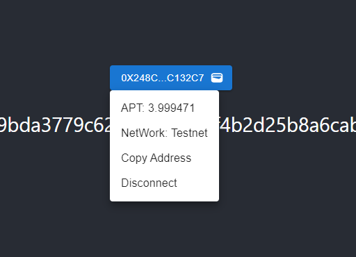

# Martian Wallet


## Available Scripts

In the project directory, you can run:

### `npm start`

Runs the app in the development mode.\
Open [http://localhost:3000](http://localhost:3000) to view it in the browser.


### `npm run build`


### Martian

Martian Wallet:  `window.aptos`

```javascript
# API
await window.martian.connect();

await window.martian.account();

await window.martian.isConnected();

await window.martian.disconnect();;
```


### Result

**Wallet Panle**

