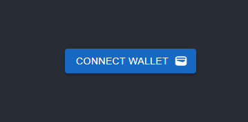
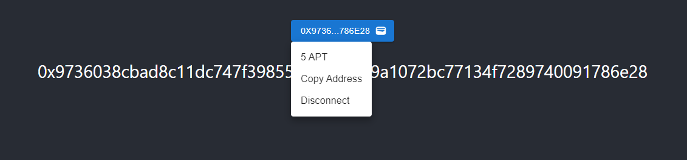

# Petra Aptos Wallet

## Start

### `npm install`

### `npm start`

> http://localhost:3000

### Description

Env: `Testnet`

API Server：`https://fullnode.testnet.aptoslabs.com`

Petra Wallet: `window.aptos`

### result

**Connect Wallet**

**Wallet Panle**

